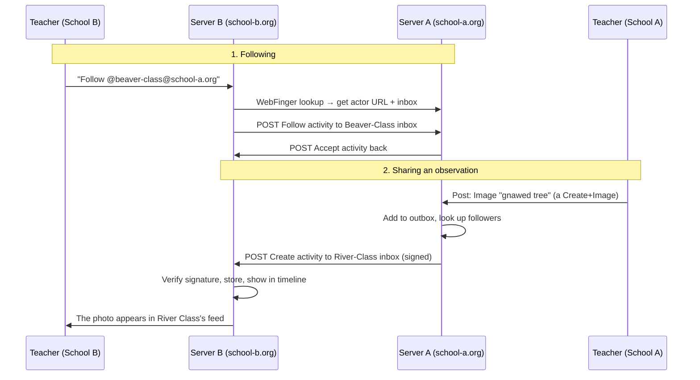

# Wild-Fedi — understanding the fediverse & building an independent network for sharing

> A learning guide for LICHEN. The goal: understand how the fediverse works, then use it
> to build an **independent, federated network** where outdoor schools share their nature
> observations — photos, audio/video captures, notes, species tracking — without depending
> on a central platform.

---

## 1. The mental model (start here)

Today's mainstream social platforms are **one company, one server, one set of rules**. You
open an account *on Instagram*, and you can only talk to other people *on Instagram*.

The **fediverse** ("federation" + "universe") flips this. It is not a website — it is an
**agreement between many independent servers to speak the same language**. Anyone can run a
server. Servers that speak the language can follow, reply to, and share with each other,
even though they are owned by different people and run different software.

Think **email**, not Instagram:

- Your email is `you@school-A.org`, your colleague's is `them@school-B.org`.
- Two different providers, two different servers — yet a message crosses freely.
- Nobody "owns" email. There is just a shared protocol (SMTP) everyone respects.

The fediverse is that, but for social sharing. The shared protocol is **ActivityPub**.

```
   ┌──────────────┐        ActivityPub        ┌──────────────┐
   │  School A     │ <───────────────────────> │  School B     │
   │  (your server)│                           │  (their server)│
   └──────────────┘                           └──────────────┘
          ▲                                            ▲
          │              ActivityPub                   │
          └──────────────┐        ┌───────────────────┘
                         ▼        ▼
                    ┌──────────────┐
                    │  School C     │
                    └──────────────┘

   No center. Each school owns its data. They federate by choice.
```

An individual server is called an **instance**. The whole set of instances that can reach
each other is the fediverse.

---

## 2. ActivityPub in one page

ActivityPub is a **W3C standard** (2018). It defines how servers exchange social actions as
JSON messages. You only need five ideas.

### a. Actors
Every participant is an **actor** — a user, a school, a bot, a group. An actor is just a
document at a URL, e.g. `https://school-a.org/users/beaver-class`. It declares:

- `inbox` — a URL where others POST messages *to* this actor.
- `outbox` — a URL listing what this actor has published.
- `publicKey` — used to prove messages really came from it (see *Signatures*).
- `followers` / `following` — collections of relationships.

Actor **types** matter for LICHEN: `Person`, `Group` (a class), `Organization` (a school),
`Service` (an automated capture station), `Application`.

### b. Objects
The *things* being shared: `Note` (short post), `Article` (long text), `Image`, `Video`,
`Audio`, `Document`, `Place` (a geolocation!). Each object has a globally unique `id` (a
URL), a `type`, content, attachments, tags.

### c. Activities
The *verbs* wrapped around objects: `Create`, `Update`, `Delete`, `Follow`, `Accept`,
`Like`, `Announce` (= boost/reshare), `Undo`, `Add`/`Remove` (to collections). A post is
literally a `Create` activity containing a `Note` object.

### d. Delivery: inbox / outbox
This is the whole engine, and it's simple:

- To **publish**, an actor puts an activity in its **outbox**.
- To **deliver** to someone, the server **POSTs** that activity to the recipient's
  **inbox** URL. For many followers at once, servers POST to a shared `sharedInbox`.
- To **receive**, your server exposes an inbox endpoint and processes what lands there.

### e. Addressing & "Public"
Every activity has `to` / `cc` fields (like email). The magic address
`https://www.w3.org/ns/activitystreams#Public` means "anyone can see this". Otherwise it
goes only to listed actors or to a `followers` collection.

Two supporting pieces glue it together:

- **WebFinger** — turns a human handle `@beaver-class@school-a.org` into the actor URL.
  Clients query `https://school-a.org/.well-known/webfinger?resource=acct:beaver-class@school-a.org`.
  This is why fediverse handles look like email addresses.
- **HTTP Signatures** — every server-to-server POST is cryptographically signed with the
  sender's private key. The receiver fetches the sender's `publicKey` and verifies it. This
  is how `school-b.org` trusts that a message *really* came from `school-a.org` and wasn't
  forged. (Not strictly part of the core spec, but the de-facto rule everyone follows.)

---

## 3. The journey of one shared observation (walkthrough)

Say the *Beaver Class* at School A posts a photo of a gnawed tree, and the *River Class* at
School B follows them.



That's federation. No central server was involved. Each school kept its own copy of its own
data and *chose* to be connected.

---

## 4. Two ways to build your network

### Path A — Run existing software (fast, realistic for a prototype)

You don't have to write a protocol implementation. Mature open-source apps already speak
ActivityPub. You self-host one per school (or one shared instance), and they federate for
free. Pick by the *type of content* you're sharing:

| Software        | Best for                        | Why it fits LICHEN                                   |
|-----------------|---------------------------------|-----------------------------------------------------|
| **PixelFed**    | Photos (Instagram-like)         | Observation photos with captions, albums, geotags   |
| **PeerTube**    | Video & audio                   | Victor's beaver tracking, field audio/video captures |
| **GoToSocial**  | Lightweight microblog (single Go binary, low RAM) | Cheap to self-host per school; text + image notes; runs on a Raspberry Pi |
| **BookWyrm**    | Cataloguing + reviews           | Model for a shared *repository of study objects* (a species = a "work") |
| **Lemmy / PieFed** | Topic forums / link aggregation | Per-ecosystem discussion threads, participatory science |
| **Mobilizon**   | Events & groups                 | Field outings, coordinating between schools          |
| **WriteFreely** | Long-form writing               | Research write-ups, project journals                 |

For a first LICHEN prototype, a common recipe is: **GoToSocial** (notes + photos, tiny
footprint) or **PixelFed** (photo-first), one instance per participating school. They
federate out of the box.

**Trade-off:** fastest to a working network, but you inherit each app's data model. A
"gnawed tree observation" becomes a generic photo post — the *scientific* structure
(species, date, location, measurements) lives only in the caption unless you extend it.

### Path B — Build a custom ActivityPub service (most control, deeper learning)

If the shared object should be a real **naturalist observation** (structured: species,
coordinates, timestamp, media, method), you build your own small server that speaks
ActivityPub. You then federate with each other *and* with generic fediverse apps.

Don't implement the protocol from scratch — use a framework:

| Language      | Framework                              |
|---------------|----------------------------------------|
| TypeScript / JS | **Fedify** (`@fedify/fedify`, fedify.dev) — modern, well-documented, recommended for new projects |
| Python        | **bovine**, or **Takahē** / Django-based helpers |
| Go            | **go-fed/activity**                    |
| Ruby          | the stack Mastodon itself uses         |

A minimal custom instance must expose:

1. **Actor documents** — `GET /users/:name` returning the actor JSON (with `inbox`,
   `outbox`, `publicKey`).
2. **WebFinger** — `GET /.well-known/webfinger` so handles resolve.
3. **Inbox** — `POST /users/:name/inbox`: verify the HTTP signature, then handle incoming
   `Follow` / `Create` / `Like` / `Announce` / `Undo`.
4. **Outbox** — `GET /users/:name/outbox`: the actor's published activities.
5. **Followers collection** — `GET /users/:name/followers`.
6. **Signing & delivery** — sign outgoing POSTs, deliver to followers' inboxes.
7. **NodeInfo** — `GET /.well-known/nodeinfo` so other servers can discover what you run.

Everything else (a nice UI, capture-station integration, offline sync) is *your* app on top
of these seven contracts.

---

## 5. Mapping the fediverse onto LICHEN

Your `synthese-directionelle.md` describes exactly a federated system: capture stations,
a repository of photos/text/documents that trace children's research, and *"leur espace
fédéré avec le réseau d'école"*. Here is how the fediverse concepts translate:

| LICHEN concept                          | Fediverse concept                              |
|-----------------------------------------|------------------------------------------------|
| A school                                | An **instance** (`Organization` actor)         |
| A class / project group                 | A **`Group` actor** others can follow          |
| A capture station (camera, sensor)      | A **`Service` actor** that auto-posts           |
| A child / accompagnateur                | A **`Person` actor**                            |
| One nature observation                  | A **`Create`** wrapping an `Image`/`Video`/`Note` + a `Place` (geo) |
| A study subject (a species, a biotope)  | An **object others can follow & append to**    |
| "Following the beaver over time"        | **Following** a group/subject → a live timeline |
| Adding a manual photo to shared research| **Reply / `Create`** addressed to that subject  |
| Reposting another school's finding      | **`Announce`** (boost)                          |
| The network of schools                  | The **federation** — chosen connections         |

### An observation as an ActivityPub object (sketch)

```json
{
  "@context": ["https://www.w3.org/ns/activitystreams"],
  "type": "Create",
  "actor": "https://school-a.org/groups/beaver-class",
  "to": ["https://www.w3.org/ns/activitystreams#Public"],
  "object": {
    "type": "Note",
    "content": "Traces de rongement fraîches sur un saule au bord de la rivière.",
    "published": "2026-09-29T09:14:00Z",
    "attachment": [
      { "type": "Image", "url": "https://school-a.org/media/gnawed-tree.jpg",
        "name": "Écorce rongée à ~30 cm du sol" }
    ],
    "location": {
      "type": "Place", "name": "Rivière, aval du pont",
      "latitude": 45.75, "longitude": 4.85
    },
    "tag": [
      { "type": "Hashtag", "name": "#castor" },
      { "type": "Hashtag", "name": "#suivi-naturaliste" }
    ]
  }
}
```

Generic fediverse apps will show this as a nice geotagged photo post. Your own LICHEN app
can read the *same* JSON and understand it as a **structured observation** (species tag,
coordinates, timestamp) it can plot on a map or add to a species' research thread. That dual
reading — human-friendly *and* structured — is the payoff of using an open standard.

---

## 6. Staying "wild" — independent & self-governed

The whole point of federation is **not depending on a platform**. To keep it that way:

- **Own the domains.** Identity in the fediverse is the domain (`@class@school-a.org`). If a
  school owns its domain, it owns its identity and can move hosts without losing it.
- **Own the data.** Each instance stores its own posts and media. Losing one server doesn't
  take down the network.
- **Choose your neighbours.** Instances decide who they federate with (allow-list or
  block-list). For a *children's* network this is essential — you can run a **closed
  federation**: only vetted schools' instances talk to each other, invisible to the wider
  fediverse. You get the protocol's benefits without exposing children to the open network.
- **Moderation is local.** Each school moderates its own instance and can defederate from a
  server that misbehaves. There is no central authority to appeal to — which is the freedom
  *and* the responsibility.
- **Interoperate on purpose.** Because it's a standard, a LICHEN observation can also be
  read by Mastodon, PixelFed, etc. Decide deliberately whether you want that openness or a
  walled garden of trusted schools.

---

## 7. A suggested learning path

1. **See it work.** Make an account on a public Mastodon/PixelFed instance; follow someone
   on a *different* instance. Watch a cross-server interaction happen. That's federation.
2. **Self-host one.** Stand up **GoToSocial** (single binary, minimal) or **PixelFed** on a
   cheap VPS or a Raspberry Pi. Federate two instances you control. Now you've built a
   two-node network.
3. **Read the wire.** Fetch an actor document and an object with `curl` and read the JSON —
   compare it to Section 2. It will click.
4. **Prototype custom.** With **Fedify**, build a tiny server exposing the seven endpoints
   from Path B, that posts a structured *observation* object. Confirm a Mastodon account can
   follow it and see the posts.
5. **Design the LICHEN object.** Settle the observation schema (species, geo, media, method)
   as an ActivityStreams object and document it here next to this README.

---

## 8. Further reading

- **ActivityPub** (W3C Recommendation): https://www.w3.org/TR/activitypub/
- **ActivityStreams 2.0** (the vocabulary): https://www.w3.org/TR/activitystreams-vocabulary/
- **WebFinger** (RFC 7033): https://datatracker.ietf.org/doc/html/rfc7033
- **Fedify** (build custom AP servers): https://fedify.dev/
- **GoToSocial** (lightweight instance): https://docs.gotosocial.org/
- **PixelFed** (photos): https://pixelfed.org/ · **PeerTube** (video): https://joinpeertube.org/
- **"ActivityPub as it has been understood"** — Christine Lemmer-Webber's practical notes on
  what real implementations actually do (search her name + ActivityPub).

---

*Written for the LICHEN project. This is a learning + design doc; the concrete `wild-fedi`
implementation (schema, chosen software, hosting) will follow from Section 7.*
